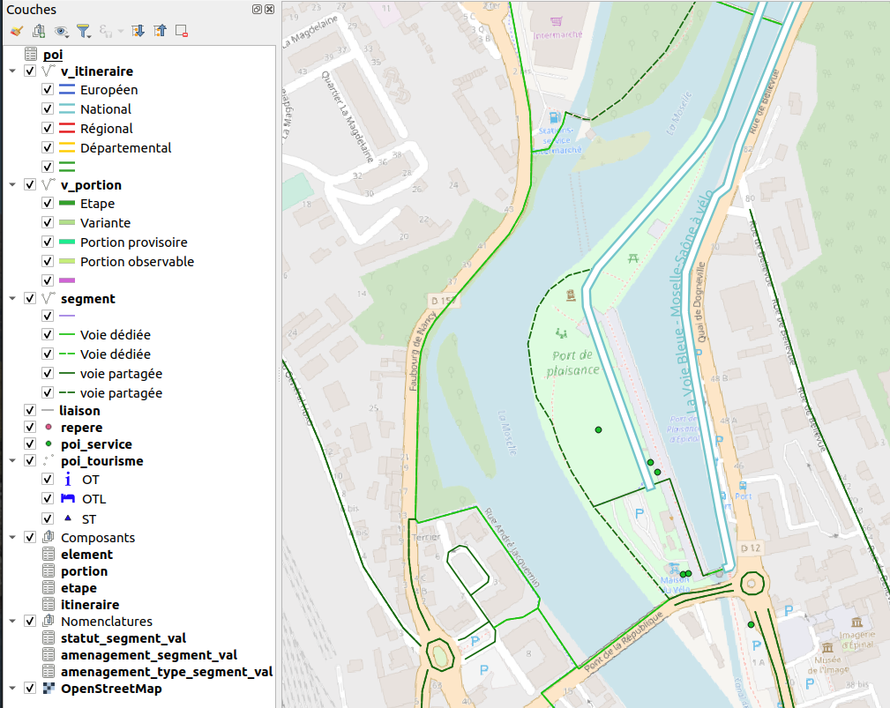

# Véloroutes et voies vertes

Extension QGIS pour la gestion des véloroutes et voies vertes suivant le standard
[COVADIS 3V](https://www.velo-territoires.org/observatoires/observatoire-national-des-veloroutes-et-voies-vertes/geostandard-velo/)

L'ensemble de la documentation (installation, guide utilisateur, traitements, base de données etc) se trouve
sur [docs.3liz.org](https://docs.3liz.org/qgis-veloroutes_voies_vertes-plugin/).

