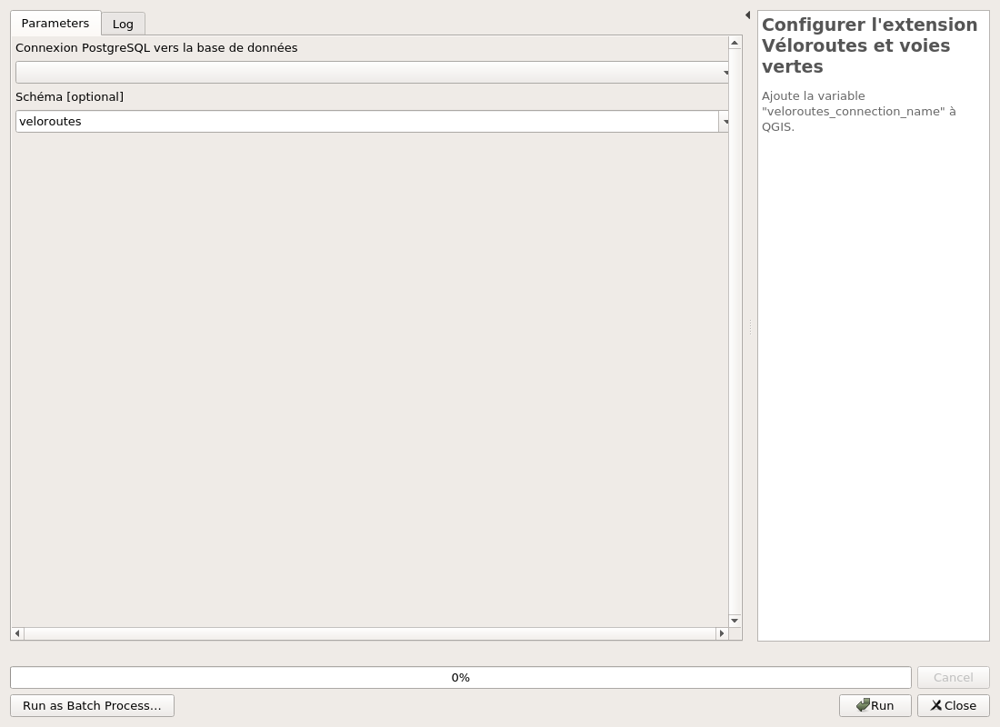

---
hide:
  - navigation
---

# Processing

## Configuration

### Configurer l'extension Véloroutes et voies vertes

Ajoute la variable "veloroutes_connection_name" à QGIS.

#### Parameters

| ID | Description | Type | Info | Required | Advanced | Option |
|:-:|:-:|:-:|:-:|:-:|:-:|:-:|
CONNECTION_NAME|Connexion PostgreSQL vers la base de données|String|Base de données de destination|✓|||

#### Outputs

| ID | Description | Type | Info |
|:-:|:-:|:-:|:-:|
OUTPUT_STATUS|Statut de sortie|Number|Statut de sortie|
OUTPUT_STRING|Message de sortie|String|Message de sortie|

***

## Base de données

### Installation de la structure sur la base de données

Création de la structure de la base données. Vous pouvez aussi charger des données de tests.

#### Parameters

| ID | Description | Type | Info | Required | Advanced | Option |
|:-:|:-:|:-:|:-:|:-:|:-:|:-:|
CONNECTION_NAME|Connexion PostgreSQL vers la base de données|String|Nom de la connexion dans QGIS pour se connecter à la base de données|✓|||
OVERRIDE|Écraser le schéma veloroutes ? ** ATTENTION ** Cela supprimera toutes les données !|Boolean||✓|||
ADD_TEST_DATA|Ajouter des données de test ?|Boolean||✓|||

#### Outputs

| ID | Description | Type | Info |
|:-:|:-:|:-:|:-:|
DATABASE_VERSION|Version de la base de données|String||

***

### Mise à jour de la structure de la base

Mise à jour de la base de données suite à une nouvelle version de l'extension.

#### Parameters

| ID | Description | Type | Info | Required | Advanced | Option |
|:-:|:-:|:-:|:-:|:-:|:-:|:-:|
CONNECTION_NAME|Connexion à la base de données|String|Nom de la connexion dans QGIS pour se connecter à la base de données|✓|||
RUN_MIGRATIONS|Cocher cette option pour lancer la mise-à-jour.|Boolean||✓|||

#### Outputs

| ID | Description | Type | Info |
|:-:|:-:|:-:|:-:|
OUTPUT_STATUS|Output status|Number||
OUTPUT_STRING|Output message|String||

***

## Covadis

### Export de tous les fichiers

Exporter tous les fichiers au format shape d'ESRI

#### Parameters

| ID | Description | Type | Info | Required | Advanced | Option |
|:-:|:-:|:-:|:-:|:-:|:-:|:-:|
DATABASE|Connexion à la base de données|String|Nom de la connexion dans QGIS pour se connecter à la base de données|✓|||
SCHEMA|Schéma|String|Nom du schéma où importer les données|||Default: veloroutes   |
DPT|Département au format XXX|String|Pour le département de l'Ain, mettre 001|✓||Default: 066   |
FOLDER|Chemin de destination|FolderDestination|Chemin de destination pour enregistrer les exports Shapefile|✓|||
CHARGER|Charger le fichier d'export dans le projet|Boolean|Si le traitement doit charger la couche Shapefile dans le projet|✓|||

#### Outputs

| ID | Description | Type | Info |
|:-:|:-:|:-:|:-:|
FOLDER|Chemin de destination|Folder||
OUTPUT|Couches de sortie|VectorLayer|Les couches de l'export|

***

### Export des données

Exporter un fichier au format shape d'ESRI

#### Parameters

| ID | Description | Type | Info | Required | Advanced | Option |
|:-:|:-:|:-:|:-:|:-:|:-:|:-:|
DATABASE|Connexion à la base de données|String|Nom de la connexion dans QGIS pour se connecter à la base de données|✓|||
SCHEMA|Schéma|String|Nom du schéma où importer les données|||Default: veloroutes   |
TABLE|Donnée à exporter|Enum|Nom de la table à exporter|✓||Values: itineraire, portion, element, segment, repere, liaison, poi_portion, poi_acces, poi_service, poi_tourisme, etat_avancement_val, revetement_val, statut_segment_val, portion_val, repere_val  |
DPT|Département au format XXX|String|Pour le département de l'Ain, mettre 001|✓||Default: 066   |
FOLDER|Chemin de destination|FolderDestination|Chemin de destination pour enregistrer les exports Shapefile|✓|||
CHARGER|Charger le fichier d'export dans le projet|Boolean|Si le traitement doit charger la couche Shapefile dans le projet|✓|||

#### Outputs

| ID | Description | Type | Info |
|:-:|:-:|:-:|:-:|
FOLDER|Chemin de destination|Folder||
OUTPUT|Couches de sortie|VectorLayer|Les couches de l'export|

***

### Import des données dans le format COVADIS

Charger les données des différentes couches

#### Parameters

| ID | Description | Type | Info | Required | Advanced | Option |
|:-:|:-:|:-:|:-:|:-:|:-:|:-:|
DATABASE|Connexion PostgreSQL vers la base de données|String|Base de données de destination|✓|||
SCHEMA|Schéma|String|Nom du schéma où importer les données|||Default: veloroutes   |
TABLE|Table de destination|String|Nom du schéma où importer les données|✓||Default: portion   |
INPUT|Couche à importer|VectorLayer||✓||Type: TypeVector  |
MATRIX|matrix|Matrix||✓||Default: ['TYPE_PORTION_COVADIS', 'type_portion', 'MONTANT_SUBVENTION', 'mont_subv', 'ANNE_SUBVENTION', 'annee_subv', 'fid', 'id_import', 'LIEN_ITIN', 'lien_itin', 'LIEN_CYCLO', 'lien_segm']   |

#### Outputs

| ID | Description | Type | Info |
|:-:|:-:|:-:|:-:|
OUTPUT MSG|Message de sortie|String||

***

## Données

### Chargement des couches depuis la base

Charger toutes les couches de la base de données.
Vous pouvez aussi ajouter un fond raster OpenStreetMap

#### Parameters

| ID | Description | Type | Info | Required | Advanced | Option |
|:-:|:-:|:-:|:-:|:-:|:-:|:-:|
DATABASE|Connexion à la base de données|String|Nom de la connexion dans QGIS pour se connecter à la base de données|✓|||
SCHEMA|Schéma|String|Nom du schéma pour importer les couches|||Default: veloroutes   |
RASTER|Ajouter un fond raster OpenStreetMap ?|Boolean||✓|||

#### Outputs

| ID | Description | Type | Info |
|:-:|:-:|:-:|:-:|
OUTPUT|Couches de sortie|MultipleLayers|Les différentes couches de l'extension véloroutes et voies vertes|
OUTPUT MSG|Message de sortie|String|Message de sortie|

***

### Chargement des styles depuis le dossier resources

Charger les styles pour les différentes couches.

#### Parameters

| ID | Description | Type | Info | Required | Advanced | Option |
|:-:|:-:|:-:|:-:|:-:|:-:|:-:|
DATABASE|Connexion PostgreSQL vers la base de données|String|Base de données de destination|✓|||
SCHEMA|Schéma|String|Nom du schéma pour chercher les couches|||Default: veloroutes   |

#### Outputs

| ID | Description | Type | Info |
|:-:|:-:|:-:|:-:|
OUTPUT MSG|Message de sortie|String|Message de sortie|
OUTPUT|Couches dont le style a été modifié|MultipleLayers|Les différentes couches de l'extension véloroutes et voies vertes|

***

