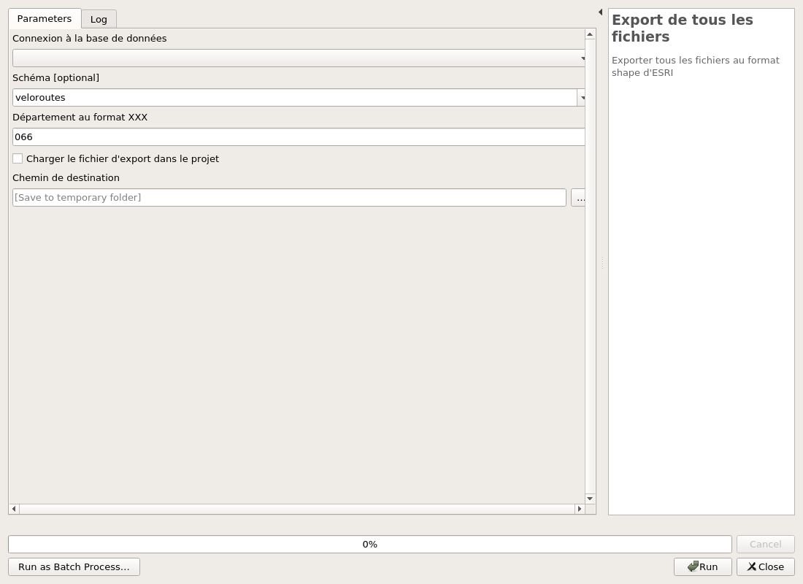

---
Title: Véloroutes et voies vertes COVADIS
Favicon: ../icon.png
...

[TOC]

# Véloroutes et voies vertes COVADIS

## Configuration

### Configurer le plugin Véloroutes et voies vertes

Ajoute la variable "veloroutes_connection_name" à QGIS.

#### Parameters

| ID | Description | Type | Info | Required | Advanced |
|:-:|:-:|:-:|:-:|:-:|:-:|
CONNECTION_NAME|Connexion à la base PostgreSQL|String|Nom de la connexion dans QGIS pour se connecter à la base de données|✓||

#### Outputs

| ID | Description | Type | Info |
|:-:|:-:|:-:|:-:|
OUTPUT_STATUS|Statut de sortie|Number|Statut de sortie|
OUTPUT_STRING|Message de sortie|String|Message de sortie|

***

## Structure

### Installation de la structure sur la base de données

Création de la structure de la base données. Vous pouvez aussi charger des données de tests.

#### Parameters

| ID | Description | Type | Info | Required | Advanced |
|:-:|:-:|:-:|:-:|:-:|:-:|
CONNECTION_NAME|Connexion PostgreSQL vers la base de données|String||✓||
OVERRIDE|Écraser le schéma veloroutes ? ** ATTENTION ** Cela supprimera toutes les données !|Boolean||✓||
ADD_TEST_DATA|Ajouter des données de test ?|Boolean||✓||

#### Outputs

| ID | Description | Type | Info |
|:-:|:-:|:-:|:-:|
OUTPUT_STATUS|Output status|Number||
OUTPUT_STRING|Output message|String||

***

### Mise à jour de la structure de la base

Mise à jour de la base de données suite à une nouvelle version de l'extension.

#### Parameters

| ID | Description | Type | Info | Required | Advanced |
|:-:|:-:|:-:|:-:|:-:|:-:|
CONNECTION_NAME|Connexion PostgreSQL vers la base de données|String||✓||
RUN_MIGRATIONS|Cocher cette option pour lancer la mise-à-jour.|Boolean||✓||

#### Outputs

| ID | Description | Type | Info |
|:-:|:-:|:-:|:-:|
OUTPUT_STATUS|Output status|Number||
OUTPUT_STRING|Output message|String||

***

## Covadis

### Export de tous les fichiers

Exporter tous les fichiers au format shape d'ESRI

#### Parameters

| ID | Description | Type | Info | Required | Advanced |
|:-:|:-:|:-:|:-:|:-:|:-:|
DATABASE|Connexion à la base de données|String|Nom de la connexion dans QGIS pour se connecter à la base de données|✓||
SCHEMA|Schéma|String|Nom du schéma pour chercher les couches dans la base de données|✓||
DPT|Département au format XXX|String|Pour le département de l'Ain, mettre 001|✓||
FOLDER|Chemin de destination|FolderDestination|Chemin de destination pour enregistrer les exports Shapefile|✓||
CHARGER|Charger la couche correspondante dans le projet|Boolean|Si le traitement doit charger la couche Shapefile dans le projet|✓||

#### Outputs

| ID | Description | Type | Info |
|:-:|:-:|:-:|:-:|
FOLDER|Chemin de destination|Folder||
OUTPUT|Couches de sortie|VectorLayer|Les couches de l'export|

***

### Export des données

Exporter un fichier au format shape d'ESRI

#### Parameters

| ID | Description | Type | Info | Required | Advanced |
|:-:|:-:|:-:|:-:|:-:|:-:|
DATABASE|Connexion à la base de données|String|Nom de la connexion dans QGIS pour se connecter à la base de données|✓||
SCHEMA|Schéma|String|Nom du schéma pour chercher les couches dans la base de données|✓||
TABLE|Donnée à exporter|Enum|Nom de la table à exporter|✓||
DPT|Département au format XXX|String|Pour le département de l'Ain, mettre 001|✓||
FOLDER|Chemin de destination|FolderDestination|Chemin de destination pour enregistrer les exports Shapefile|✓||
CHARGER|Charger la couche correspondante dans le projet|Boolean|Si le traitement doit charger la couche Shapefile dans le projet|✓||

#### Outputs

| ID | Description | Type | Info |
|:-:|:-:|:-:|:-:|
FOLDER|Chemin de destination|Folder||
OUTPUT|Couches de sortie|VectorLayer|Les couches de l'export|

***

### Import des données dans le format COVADIS

Charger les données des différentes couches

#### Parameters

| ID | Description | Type | Info | Required | Advanced |
|:-:|:-:|:-:|:-:|:-:|:-:|
DATABASE|Connexion à la base de données|String|Nom de la connexion dans QGIS pour se connecter à la base de données|✓||
SCHEMA|Schéma|String|Nom du schéma où importer les données|✓||
TABLE|Table de destination|String||✓||
INPUT|Couche à importer|VectorLayer||✓||
MATRIX|matrix|Matrix||✓||

#### Outputs

| ID | Description | Type | Info |
|:-:|:-:|:-:|:-:|
OUTPUT MSG|Message de sortie|String||

***

## Données

### Chargement des couches depuis la base

Charger toutes les couches de la base de données.Vous pouvez aussi ajouter un fond raster OpenSreetMap

#### Parameters

| ID | Description | Type | Info | Required | Advanced |
|:-:|:-:|:-:|:-:|:-:|:-:|
DATABASE|Connexion à la base de données|String|Nom de la connexion dans QGIS pour se connecter à la base de données|✓||
SCHEMA|Schéma|String|Nom du schéma pour chercher les couches dans la base de données|||
RASTER|Ajouter un fond raster OpenStreetMap?|Boolean||✓||

#### Outputs

| ID | Description | Type | Info |
|:-:|:-:|:-:|:-:|
OUTPUT|Couches de sortie|MultipleLayers|Les différentes couches de l'extention véloroutes et voies vertes|
OUTPUT MSG|Message de sortie|String|Message de sortie|

***

### Chargement des styles depuis le dossier resources

Charger les styles pour les différentes couches.

#### Parameters

| ID | Description | Type | Info | Required | Advanced |
|:-:|:-:|:-:|:-:|:-:|:-:|
INPUT|Champ qui ne sert à rien !|String||||

#### Outputs

| ID | Description | Type | Info |
|:-:|:-:|:-:|:-:|
OUTPUT MSG|Message de sortie|String|Message de sortie|

***

