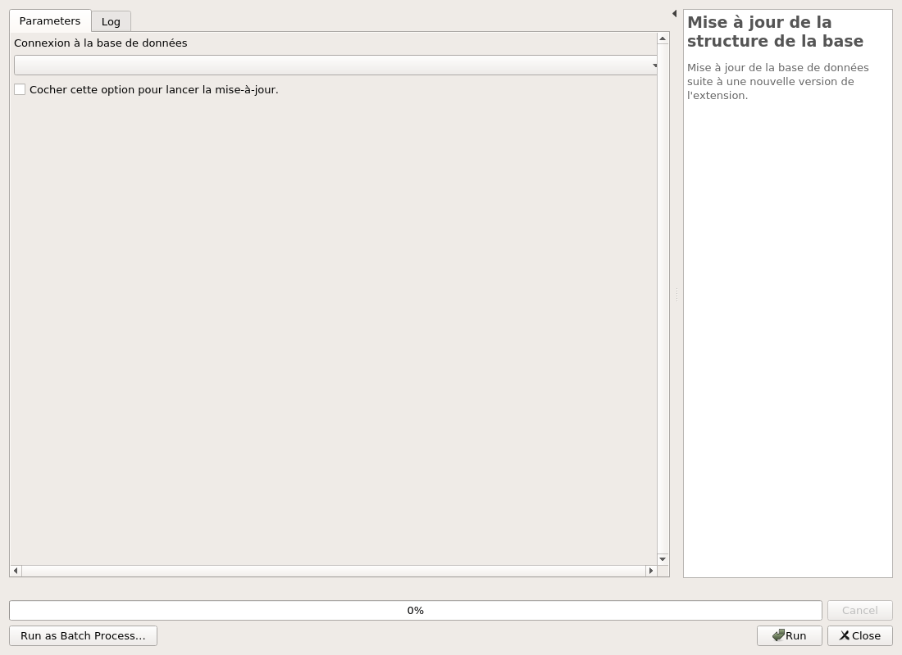

---
hide:
  - toc
---

# Gestion de la structure de données

Le plugin propose la possibilité d'installer et mettre à jour la structure en
base de données pour la gestion des Véloroutes et Voies vertes.

## Installation de la structure en base de données

## Mise à jour de la structure en base de données

