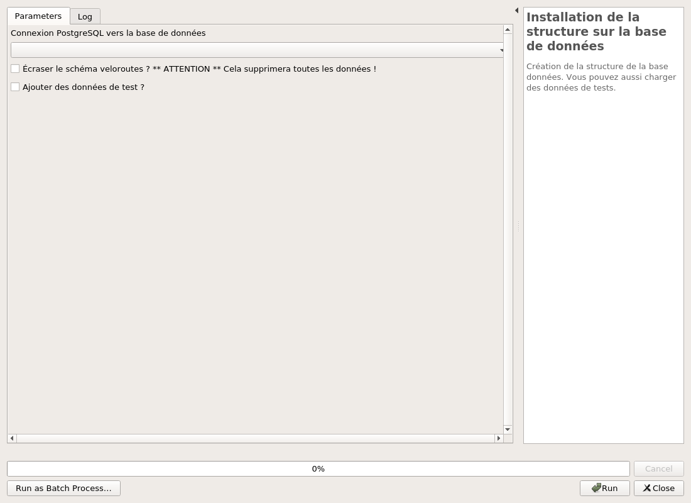

---
hide:
  - toc
---

# Gestion de la structure de données

L'extension utilise une base de données PostgreSQL pour fonctionner avec son propre schéma.

## Installation de la structure en base de données

Il est nécessaire d'installer les tables dans un premier temps.

## Mise à jour de la structure en base de données

Lors du mise à jour de l'extension, il est peut-être parfois nécessaire de faire la mise à jour de la base de
données. Ce n'est pas systématique à chaque mise à jour, mais vous pouvez toujours le faire, l'algorithme de
mise à jour vous informera si oui ou non la base de données nécessite la mise à jour.

Il n'y a pas de perte de données pendant la mise à jour.

