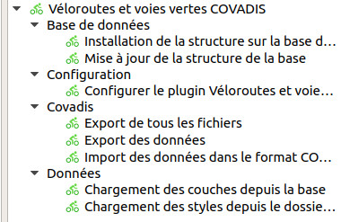

---
hide:
  - toc
---

# Guide d'utilisation

Une fois installé à l'aide du [gestionnaire d'extensions de QGIS](https://docs.qgis.org/3.16/fr/docs/user_manual/plugins/plugins.html#qgis-plugins), pour utiliser l'outil, il faut se rendre dans la boîte à outils de traitements de QGIS.

Il y a plusieurs étapes :

* [Gestion de la structure de données](./gestion-structure-donnees.md)
* [Création du projet](./initialisation-projet.md)
* [Saisie et gestion des données](./saisie-donnees.md)
