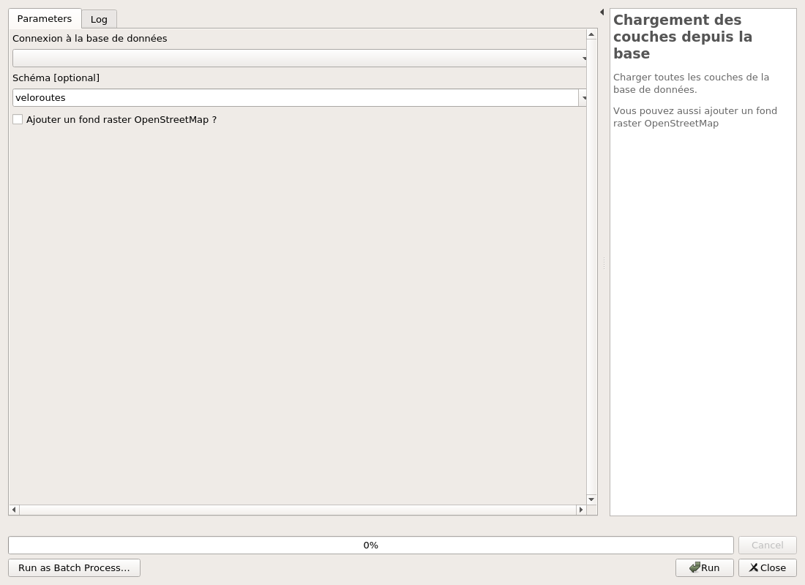
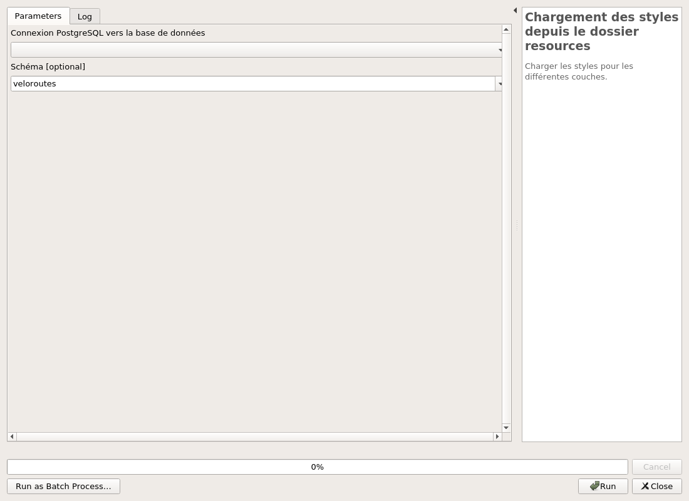

---
hide:
  - toc
---

# Création d'un projet

La création d'un nouveau projet via l'extension permet de générer un projet vide sans devoir le créer
à la main et y ajoute toutes les couches nécessaires depuis la base de données.

Cela permet aussi d'appliquer les styles (symbologies, étiquettes, formulaires, etc) fournis
par le plugin.

Pour cette partie il y a deux algorithmes :

* En premier, celui nommé **Chargement des couches deuis la base**. Il demande les paramètres suivants :
  * la connexion à la base de données depuis la liste des connexions PostGIS du profil QGIS
  * le schéma dans lequel a été chargé le modèle de données
  * une option pour ajouter la couche OpenStreetMap

Après utilisation, les couches sont chargées dans le projet.

* Le second s'appelle **Chargement des styles depuis le dossier ressources**. Il prend en paramètre :
  * la connexion à la base de données depuis la liste des connexions PostGIS du profil QGIS
  * le schéma dans lequel a été chargé le modèle de données

Ces paramètres permettent d'identifier les couches dans le projet.

