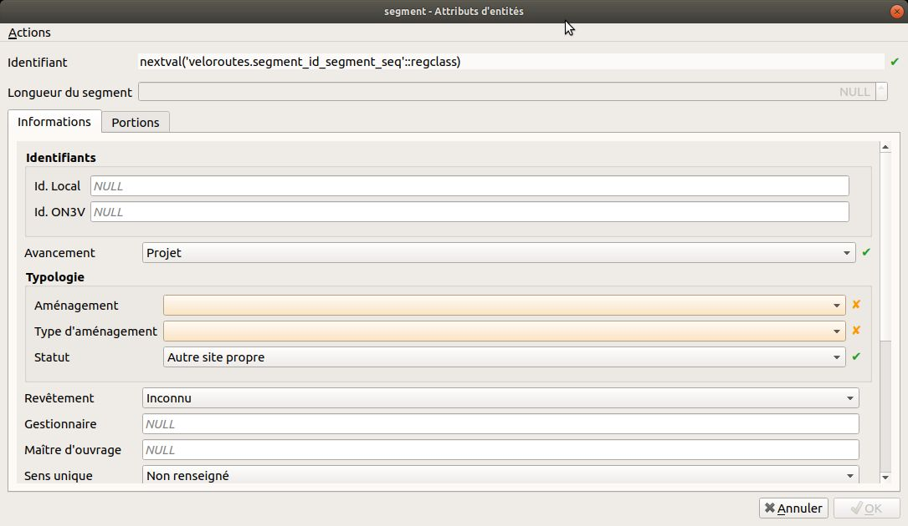
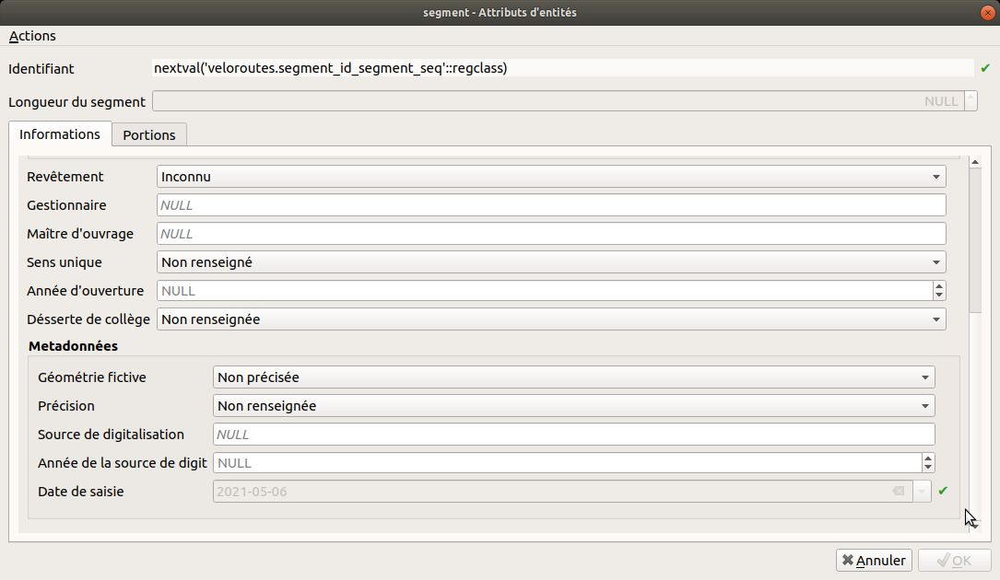
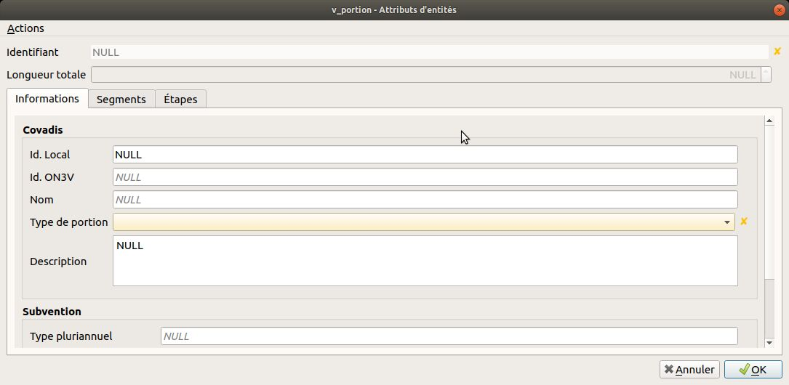
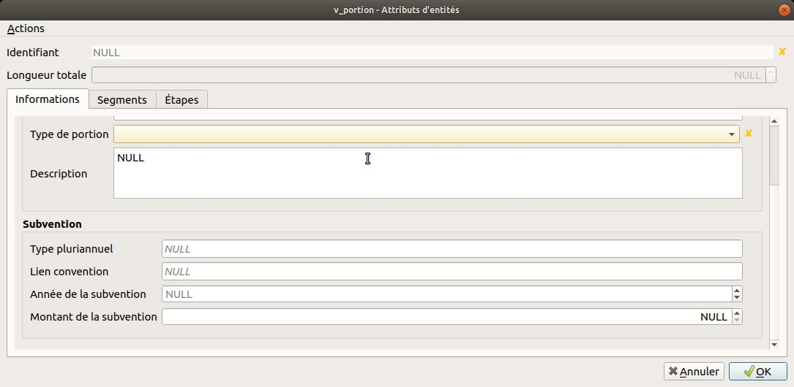
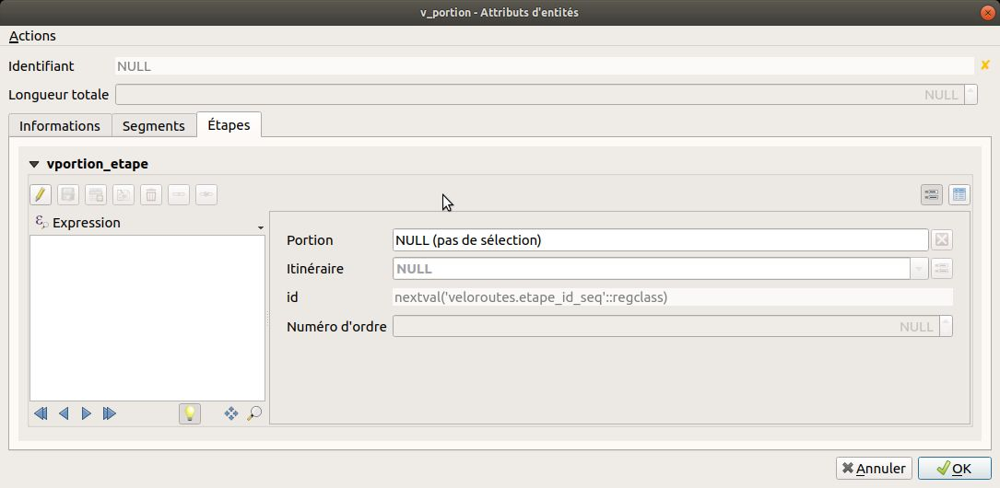
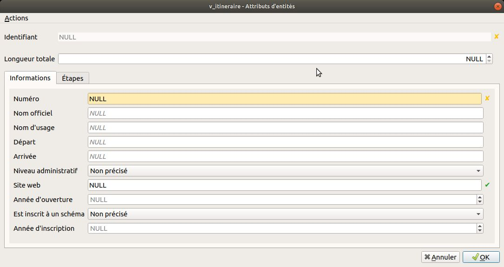

# Saisie et gestion des données Véloroutes et Voies Vertes

Une fois les couches chargées et les styles du plugin appliqués, le projet QGIS
offre tous les outils nécessaires à la saisie et la gestion des données.

## Saisie des segments

Dans le modèle de données Véloroutes et Voies Vertes, les segments sont les
éléments de base du réseau cyclable. Ils constituent les portions des itinéraires.
Leurs géométries sont la base des portions et itinéraires.

### Le formulaire

Les segments sont des lignes qui doivent être unique en fonction du type d'aménagement,
du revêtement, du gestionnaire, du sens de circulation, etc.

L'avancement permet de commencer par un projet dont la géométrie peut-être
fictive. Une fois le tracé arrêté, la géométrie représente le parcours avant
travaux. La géométrie peut-être découpée en fonction des changements de caractéristique.

Enfin le segment est ouvert à la circulation.

### Les actions

Le plugin a ajouté à la couche **segment** des actions :

* Couper un segment en un point _alias_ **Couper un segment**
* Créer une portion à partir de segments sélectionnés _alias_ **Créer une portion**

#### Couper un segment

Cette action fonctionne de la façon suivante :

* Passer la couche segment en édition
* Cliquer sur **Couper un segment** dans le menu des actions
* CLiquer sur la carte là où vous souhaitez couper le segment

Cette action conserve l'appartenance à une portion. Le segment qui aura été
pointé sera réduit et le nouveau segment créé sera ajouter à la portion du
segment initial.

#### Créer une portion

Cette action fonctionne de la façon suivante :

* Sélectionner le ou les segments constitutifs d'une nouvelle portion
* Cliquer sur **Créer une portion** dans le menu des actions

Un segment peut-être un élément de plusieurs portions

## Saisie des portions

Dans le modèle de données Véloroutes et Voies Vertes, les portions sont constitués
de segments et constituent les itinéraires. Une portion est une étape d'un itinéraire.
Elle peut-être une variante, un portion temporaire ou une portion observable
d'un itinéraire.

Une étape peut se parcourir en une journée.

### Créer une portion

La création d'une portion peut se faire de 2 façons :

* A l'aide de l'action **Créer une portion** de la couche segment
* En ajoutant une entité à la vue **v_portion**

Pour ajouter une entité à la vue **v_portion**, nous recommandons d'**Activer l'accrochage**
et d'*Activer le tracé* en précisant un **Offset**.

Ensuite, il vous suffit de cliquer le long des segments en s'assurant que
la prévisualisation de la ligne en cours de saisie suit bien les segments.

Lors de l'ajout d'une ligne à la vue **v_portion**, les segments pouvant composer
la géométrie sont sélectionnés, une ligne est ajoutée à la table **portion** et
la table **element** est complétée.

### Le formulaire

Le type de portion permet de définir le rôle de la portion au sein des itinéraires
cyclables. Ces portions constituent une étape d'ititinéraire, une variante
d'itinéraire, une portion temporaire d'itinéraire le temps que les aménagements
(segments) en projet ou en travaux soient ouvert ou une portion observable qui est
une portion sur lequel un compteur est installé.

Il est aussi possible de faire un suivi financier des aménagements (segments).
Ce suivi se fait au niveau des portions.

Enfin un itinéraire principal est composé d’une collection ordonnée d’étapes cyclables.

### Les actions

Le plugin a ajouté à la vue **v_portion** des actions :

* Suppression d'éléments de portion à partir des segments sélectionnés _alias_ **Suppression d'éléments de portion**
* Ajouter des éléments de portion à partir des segments sélectionnés _alias_ **Ajouter des éléments de portion**
* Créer un itinéraire à partir de portions sélectionnés _alias_ **Créer un itinéraire**

#### Suppression d'éléments de portion

Cette action fonctionne de la façon suivante :

* Sélectionner le ou les segments constitutifs d'une portion
* Identifier la portion concernée par cette modification
* Cliquer sur **Suppression d'éléments de portion** dans le menu des actions

#### Ajouter des éléments de portion

Cette action fonctionne de la façon suivante :

* Sélectionner le ou les segments constitutifs d'une portion
* Identifier la portion concernée par cette modification
* Cliquer sur **Ajouter des éléments de portion** dans le menu des actions

#### Créer un itinéraire

Cette action fonctionne de la façon suivante :

* Sélectionner le ou les portions constitutives d'un nouvel itinéraire
* Cliquer sur **Créer un itinéraire** dans le menu des actions

Une portion peut-être un élément de plusieurs portions

## Saisie des itinéraires

Dans le modèle de données Véloroutes et Voies Vertes, les itinéraires sont constitués
de portions. Un itinéraire contient une suite d'étapes et potentiellement
des variantes, des portions temporaires et des portions observables. Les étapes
d'un itinéraire sont ordonnées.

### Créer un itinéraire

La création d'un itinéraire peut se faire de 2 façons :

* A l'aide de l'action **Créer un itinéraire** de la vue **v_portion**
* En ajoutant une entité à la vue **v_itineraire**

Pour ajouter une entité à la vue **v_itineraire**, nous recommandons d'**Activer l'accrochage**
et d'*Activer le tracé* en précisant un **Offset**.

Ensuite, il vous suffit de cliquer le long des portions en s'assurant que
la prévisualisation de la ligne en cours de saisie suit bien les portions.

Lors de l'ajout d'une ligne à la vue **v_itineraire**, les portions pouvant composer
la géométrie sont sélectionnés, une ligne est ajoutée à la table **itineraire** et
la table **etape** est complétée.

### Le formulaire

Un itinéraire se caractérise par un numéro, un nom offciel et d'usage, une
ville de départ et d'arrivée, un niveau administratif (européen, national,
régional ou départemental) et si celui-ci a été ou est inscript à un schéma
d'aménagement et d'insvestissement.

### Les actions

Le plugin a ajouté à la vue **v_itineraire** des actions :

* Suppression d'étape sur un itinéraire à partir de portions sélectionnées _alias_ **Suppression d'étapes**
* Ajouter des étapes à partir de portions sélectionnées _alias_ **Ajouter des étapes**

#### Supression d'étapes

Cette action fonctionne de la façon suivante :

* Sélectionner le ou les portions constitutifs d'un itinéraire
* Identifier l'itinéraire concerné par cette modification
* Cliquer sur **Suppression d'étapes** dans le menu des actions

#### Ajouter des étapes

Cette action fonctionne de la façon suivante :

* Sélectionner le ou les portions constitutifs d'un itinéraire
* Identifier l'itinéraire concerné par cette modification
* Cliquer sur **Ajouter des étapes** dans le menu des actions
